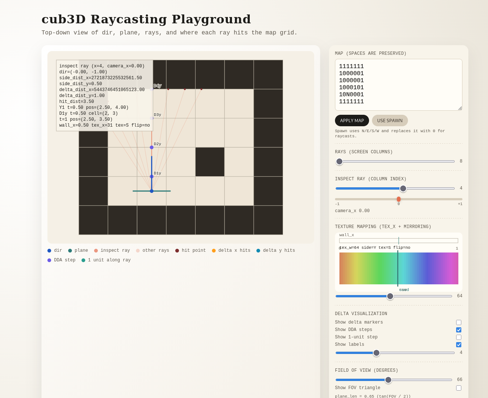

# 2D DDA Raycasting Visualizer

A tiny browser playground I made to visualize cub3D raycasting and understand how the DDA steps, camera plane, and wall hits line up.

## Run it
Open `raycasting_visualizer.html` in any browser (no build step).

## Map notes
- `1` = wall, `0` = empty, spaces are void
- Optional spawn: `N`, `E`, `S`, `W`
